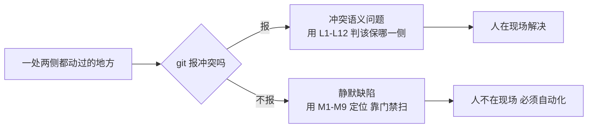
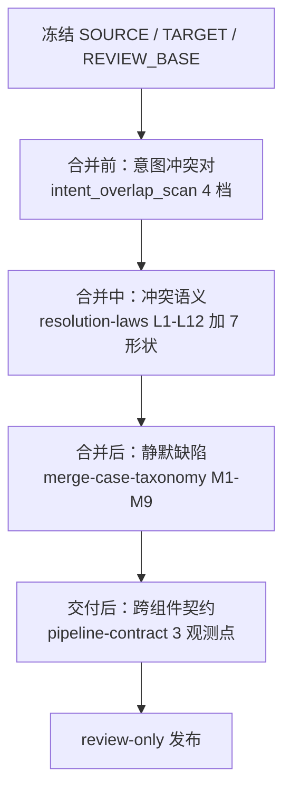
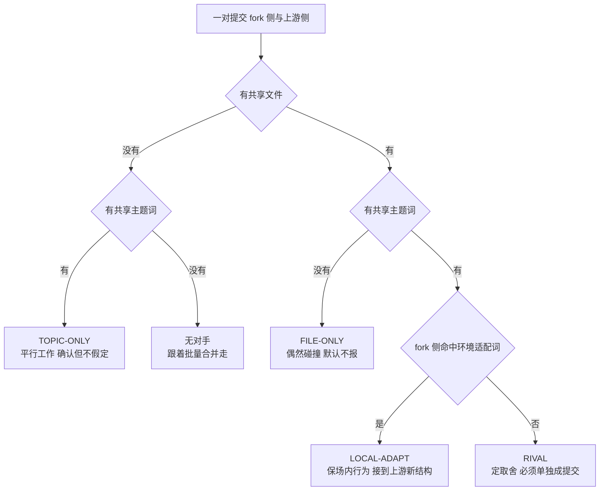
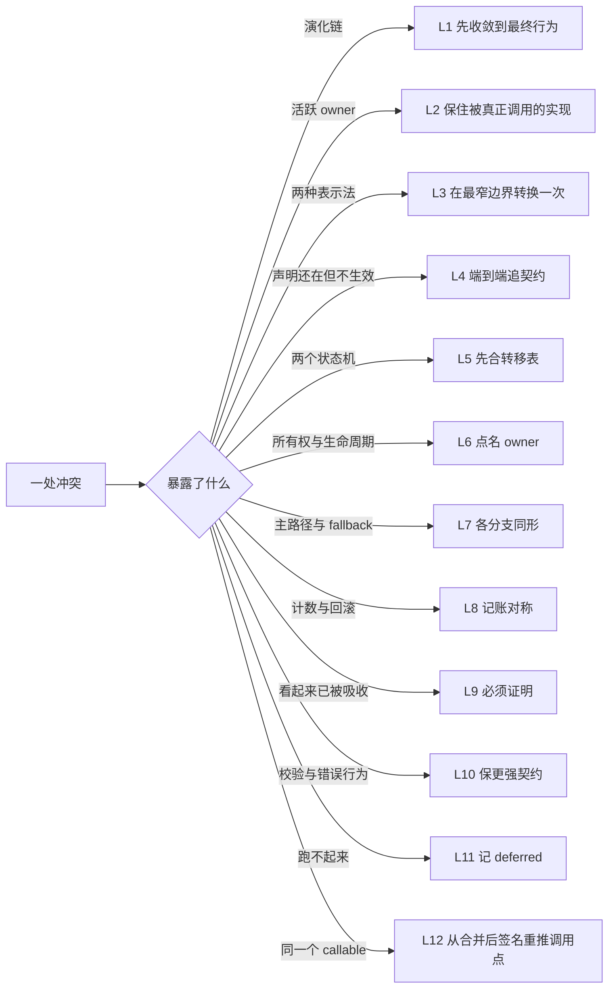
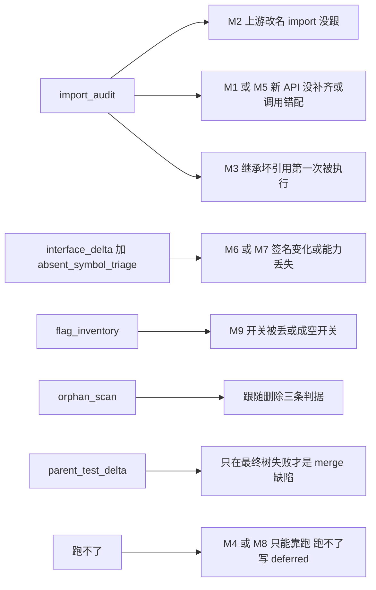
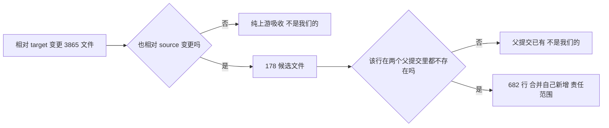
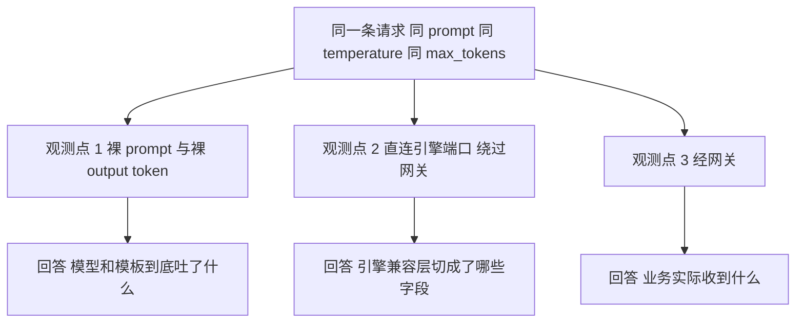

# 设计思路：为什么这样分类

`SKILL.md` 讲怎么做，三份 reference 讲每一类怎么处理。这一份讲**为什么是这套分
类**，用来给新人交底，也用来在下次改动 skill 时守住边界。

## 一、起点：一个被误判的问题

把长期分叉的 fork 和上游合起来，直觉上是个 Git 操作问题：解冲突、跑测试、发评审。
按这个直觉做完第一版，冲突全解了，测试也过了，服务起来当场炸。

原因是三方合并**按行工作**。它能看见「同一行两侧都改了」，看不见「这个函数的调用
方来自 fork、被调方来自上游」，也看不见「这个开关还在，但读它的代码没了」。

所以整套分类的第一刀不是按文件、不是按子系统，而是按 **Git 看不看得见**：



这一刀决定了后面所有工程投入的分配：冲突有人在现场，给判据就够；静默缺陷没人在
现场，必须做成脚本。

## 二、四段时间轴：为什么要往两头拉

第一版只覆盖「合并中」。跑过一次真实合并之后，两头各露出一个缺口。

往后的缺口：门禁全绿只说明仓库内部自洽。有一类契约的另一端在别人的进程里（推理链
路网关、评测框架、发版 YAML），`git diff` 和静态门禁一个都报不出来，因为最终树自
洽、服务起得来、直连引擎还正常。

往前的缺口：有些提交对在**意图上**就是重叠的，双方各做了同一个能力。这类对子按行
合并的结果最差，而且两种坏结果都不产生冲突：要么留下两份实现，要么留下 fork 的调
用方配上游的被调方。等合并做完再从几百个符号里往回找，成本高得多。



四段各自有独立的工具，是因为它们的**可见性**不同：意图重叠只能从提交元数据看出
来（文件集合加标题主题词），冲突只能在合并现场看出来，静默缺陷只能在最终树上扫出
来，跨组件契约只能把请求打穿链路才看出来。用一套工具覆盖四段做不到。

## 三、合并前：为什么用「文件稀有度」而不是「文件重叠」

配对意图重叠的提交对，最朴素的做法是「双方改过同一个文件就算一对」。这个做法在真
实仓库上直接失效：`serving_chat.py` 这类文件被上百个提交改过，于是所有提交两两配
上。第一版跑出 473 对，等于没有信号。

修法是给共享文件按稀有度加权：`weight = 1 / touch_count`。两个提交都只碰过一次的
文件是强证据，被一百个提交碰过的文件几乎不是证据。加权后 6 对。

再叠一层「提交标题的主题词」交叉，就得到四档：



环境适配词是一份固定词表（cache、hicache、asradix、mem、oom、vram、monitor、
metric、trace、log、deploy、yaml、quota、zmq、mooncake、rdma、bootstrap、
watchdog、health）。命中它意味着这是场内为自己的部署环境做的适配，上游大概率没有
对应能力，所以取舍的默认答案不同：RIVAL 要比较谁做得更好，LOCAL-ADAPT 要保住场内
行为。

落地方式也是设计的一部分：**冲突对单独 pick 并单独写 commit，其余无冲突的直接批量
merge**。一个对子一个提交的价值在追查，不在 push 形态。评审只收一个提交时，
worktree 里照样保留分段历史当处置台账，push 前用 `git commit-tree` 压平。

## 四、合并中：L 律是判据而不是清单

L1-L12 不是「按顺序检查十二遍」，而是一个反查索引：先看这一处冲突暴露了哪条不变
量，再据此决定保哪一侧。选错律不会让代码编译失败，会让判断的依据变成「谁的代码更
新」，那是最常见的错解。



L12 单独拎出来做了 7 种形状，因为它是唯一**静默失败**的一条：调用点合并时不冲突，
只在某个请求形状第一次执行时炸。静态检查只能覆盖形状 1、2、5，且要求调用点语法可
解析；形状 3（两侧参数顺序不同、个数还一样）、4（一侧转发的参数另一侧不声明）、
6（两侧都守卫同一状态，合并后做了两次）、7（一侧收窄了另一侧调用方还在产出的形
状）静态一律看不见，只能在最终树上跑每个有冲突的子系统的测试，再和两个父提交的失
败集合对比。

L11 是唯一一条不判技术的律，它判的是诚实：跑不起来就记 deferred，不许为了变绿改环
境。这条同时写进硬规则，是因为它是所有验证结论的地基，破一次全套证据都不可信。

## 五、合并后：为什么每一类都要四元组

M1-M9 有一条准入规则：一类缺陷要进 taxonomy，必须同时给出**判定信号、正确做法、
检测手段、真实实例**四样。缺检测手段的条目会退化成箴言，没人能执行；缺真实实例的
条目分不清是真见过还是想象出来的。

检测手段的设计有两条纪律。

第一条：门禁跑**全树**，不只跑改过的文件。会静默存活的缺陷大多落在没有冲突的文件
里，比如上游改名后 fork-only 文件的 import。只扫改动文件的门禁天生抓不到 M2。

第二条：报告要分「相对父提交新增」和「继承」。NEW 一律 blocker；INHERITED 只有落
在 `--critical-path` 上才是 blocker，因为那条路径这次才第一次被执行。不分这两层，
门禁会把父提交的历史债一起报出来，噪音大到没人看。



M4 和 M8 是唯二静态查不出来的两类，所以它们的「检测手段」写的是「按交付目标枚举特
性组合，把这条路径真跑一次；跑不了就写 deferred 并点名未验证的组合」。承认查不出
来，比编一个假的检测手段有用。

## 六、两个让门禁能长期活下去的设计

### waiver：永远红的门禁等于教人忽略它

在真实合并上跑，有两个门禁永久红着：2 个跟随上游删掉的 flag、21 个评审已判过的符
号。这不是门禁做错了，是门禁没有「已处置」这个状态。

修法是 waiver 文件，格式 `名字<TAB>理由`，**没写理由的行不生效**。判过的移到独立
小节，exit code 只对未处置的发现非零。强制写理由是关键：它让 waiver 从「关掉告
警」变成「记录决定」，而理由列本身就是 CR 里的处置记录。

waiver 是每次合并的数据，跟产物放一起，不进 skill 仓库。

### 只报「我们写的」：责任范围要能算出来

评审 diff 的 base 是 fork 目标分支，所以它同时包含上游新增的每一行。在一次真实合
并里这意味着 42 万行新增、3865 个变更代码文件。任何在这个范围上做的规范检查，报出
来的绝大多数都是上游的代码，不是我们该改的。

算法很简单但必须显式做：**同一路径下，在两个父提交里都不存在的行才算合并自己新增
的**。同一次合并里，这个口径把 3865 个文件收敛到 178 个候选、682 行真正属于我们的
内容。



## 七、交付后：先定位「谁在加工数据」，再动代码

跨组件契约这一类的教训代价最高：连续三版 patchset 都建立在「网关会按标记自行切
分」这个从没验证过的假设上，全部作废。

所以 `pipeline-contract.md` 的第一条不是任何具体结论，而是一个实验设计：同一条请
求在三个观测点各打一次，diff 三份输出，哪一层的字段和上一层不一样，责任方就锁定在
这两层之间。



缺哪一个都会误判：只有 2 和 3 会把模板的行为算到引擎头上；只有 1 和 3 会把引擎兼
容层的行为算到网关头上。

还有一条比正向观察更强的手段：**反向对照**。改一版镜像，只动引擎侧的输出形状，再
看网关输出有没有跟着变。跟着变，网关就是透传的。输出「看起来对」可以是任意一层修
补出来的，不能当证据用。

## 八、证据分级：防止把弱证据当强证据

```text
E0  断言、文件存在
E1  diff / AST / 静态结构
E2  带反向对照的可执行探针（先证明未修复时会失败）
E3  仓库自带测试
E4  构建或集成测试
E5  代表性运行时冒烟
```

分级的用途是在 CR 描述里把结论和它的证据强度绑在一起。E2 那句「先证明未修复时会失
败」是整条阶梯里最容易被跳过的一步，也是区分「探针有效」和「探针恒真」的唯一办法。

## 九、这套分类的边界

它不管三件事，写清楚是为了不让人误用：GPU 集群的资源调度、精度调优本身、以及上游
代码自身的质量。跨组件契约只给验证清单和判定点，不代管环境。

还有一条自我约束：一类新缺陷进 taxonomy 之前，先问它是不是已有某类的变体。M8 的
「档位」形状就是这么进去的：它不是新类，是 M8 原有定义漏掉的一半（自适应特性在运
行时改变档位，低档位是独立代码路径）。能挂在已有类下的，不新开编号。
